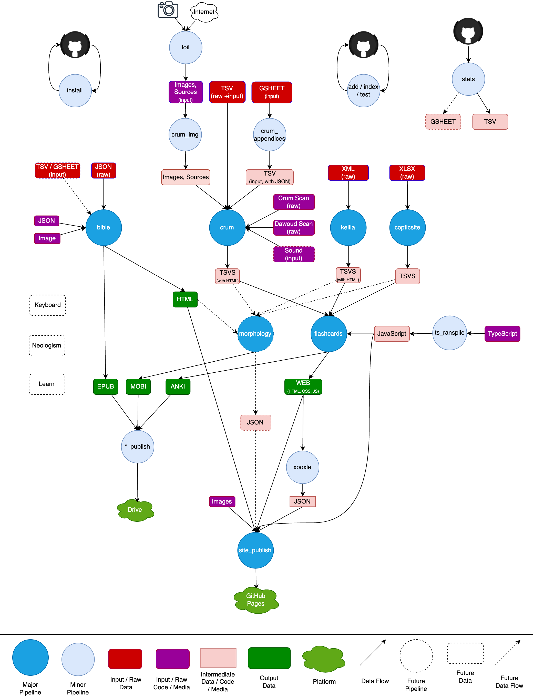

# [ⲣⲉⲙⲛ̀Ⲭⲏⲙⲓ](https://remnqymi.com/)

This is the backing repo for [ⲣⲉⲙⲛ̀Ⲭⲏⲙⲓ](https://remnqymi.com/), a project
that aims to make the Coptic language more **learnable**.

<!-- START doctoc generated TOC please keep comment here to allow auto update -->
<!-- DON'T EDIT THIS SECTION, INSTEAD RE-RUN doctoc TO UPDATE -->

- [Technical Docs](#technical-docs)
  - [Hosting](#hosting)
  - [Diagram](#diagram)
  - [Getting started](#getting-started)
  - [`data/` Subdirectories](#data-subdirectories)
  - [`.env`](#env)
  - [Planning](#planning)
    - [Issues](#issues)
    - [Project](#project)
    - [Milestones](#milestones)
    - [Labels](#labels)
  - [Guidelines](#guidelines)
    - [Languages](#languages)
  - [`stats`](#stats)
- [Project-specific](#project-specific)
  - [`dictionary/`](#dictionary)
    - [`marcion.sourceforge.net/`](#marcionsourceforgenet)
      - [Image Collection](#image-collection)
        - [Why?](#why)
        - [Technical Guidelines](#technical-guidelines)
      - [Undialected Entries](#undialected-entries)
      - [Entries that are Absent in Crum](#entries-that-are-absent-in-crum)
    - [`copticocc.org/`](#copticoccorg)
    - [`kellia.uni-goettingen.de/`](#kelliauni-goettingende)
    - [`copticsite.com/`](#copticsitecom)
  - [`bible/`](#bible)
    - [`stshenouda.org/`](#stshenoudaorg)
  - [`flashcards/`](#flashcards)
    - [Anki Keys and Synchronization](#anki-keys-and-synchronization)
  - [`morphology/`](#morphology)
  - [`site/`](#site)

<!-- END doctoc generated TOC please keep comment here to allow auto update -->
# Technical Docs

[](https://github.com/pre-commit/pre-commit)

## Hosting

We use:

- [GitHub](https://github.com/pishoyg/coptic/) for our code base.
- [GitHub Pages](https://github.com/pishoyg/pishoyg.github.io/) for our
[website](https://remnqymi.com/).
- [Google Drive](https://drive.google.com/drive/folders/17jI92CKumjYQTXghThaaejPeD8ZbifPm?usp=drive_link) to share large files.
- [Google
Analytics](https://analytics.google.com/analytics/web/#/p454349148) to analyze traffic.
- [Squarespace](https://account.squarespace.com/domains/managed/remnqymi.com) for DNS registration.

## Diagram

<div align="center">
   <figure>
      
   </figure>
</div>

*NOTE: You can update the diagram by uploading it to
[draw.io](https://draw.io/).*

## Getting started

1. Running `make install` should take care of most of the python installations.

   If there are missing binaries that you need to download them, `make install`
   will let you know.

1. You might also want to alias `python` to the latest version.

1. Our pipelines are defined in [`Makefile`](Makefile), and they correspond to
blue circles in the diagram. Other pipelines in [`Makefile`](Makefile) are only
used during development and testing, and are not relevant for output
(re)generation.

1. Keep in mind that parameters are written with the assumption that they are
   being invoked from the repo's root directory, rather than from the directory
where the script lives. You should do most of your development from within the
root directory.

1. This file is the only `README.md` in the repo (and this is enforced by a
   pre-commit hook). Technical documentation is intentionally centralized.
Besides this file, docs can be found in:

   - In-code comments
   - [Planning framework](#planning)
   - [Commit messages](https://github.com/pishoyg/coptic/commits/) (*albeit
   less significantly*)

   User-facing documentation shouldn't live on the repo, but should go on [the
   website](http://remnqymi.com/) instead.

1. With the exception of [`archive/`](archive/), [`test/`](test/), and [
`data/`](data/), and [`pre-commit/`](pre-commit/), each subdirectory of the
root directory represents a major pipeline, or category of pipelines, along
with their associated data. You will also notice that shared code is
(intentionally) minimized, and restricted to the pre-commits and some helpers
and utility functions.

1. We use pre-commit hooks extensively, and they have helped us discover a lot
   of bugs and issues with our code, and also keep our repo organized. They are
not optional, and many of our pipelines assume that the pre-commits have done
their job. Their installation should be covered by `make install`. They are
defined in [`.pre-commit-config.yaml`](.pre-commit-config.yaml). They run
automatically before a commit, but you can trigger them with Make recipes as
well by typing `make add`, `make index`, or `make test` (the three are
synonymous).
Until [#120](https://github.com/pishoyg/coptic/issues/120) is resolved, you
will need to pay some attention to when to trigger them manually. As a rule of
thumb, run them once after each pipeline, and before starting another
downstream pipeline.

## `data/` Subdirectories

Most of our projects have a `data` subdirectory. We have somewhat strict rules
regarding its content. It usually (which, in our repo, means _almost always_)
contains three subdirectories:

- `raw/`: Data that is **copied** from elsewhere. This would, for example,
include the Marcion SQL tables copied as is, unmodified. The contents of this
directory remain true to the original source.

- `input/`: Data that we either *modified* or *created*. If we want to fix
typos to data that we copied, we don't touch the data under `raw/`, but we take
the liberty to modify the copies that live under `input/`.

   This directory also includes the data that we created ourselves.

   You can show the delta between raw and input data using `git diff
   --no-index`. It's also good to be aware of the `--word-diff` flag.

- `output/`: This contains the data written by our pipelines,
**one subdirectory per format**. If your pipeline writes both TSV and HTML,
they should go respectively to `output/tsv/` and `output/html/`.

## `.env`

For now, run this once at the beginning of your coding session to export
environment variables, which are necessary for some pipelines:

```sh
source .env_INFO
```

Equivalently:

```sh
. ./.env_INFO
```

Later on, you might need to create your own `.env` file. It is ignored by a
rule in [`.gitignore`](.gitignore), so there is no shared version.

It is documented in [`.env_INFO`](.env_INFO), so this section is intentionally
brief.

## Planning

We use GitHub to track our plans and TODO's.

### [Issues](https://github.com/pishoyg/coptic/issues/)

Issues need to be as specific and isolated as possible. Most of the time, they
span a single component, although they can often work mainly in one component
and spill to others, and sometimes they're generic and span one aspect of
multiple components (such as the conventions set for the whole repo). Issues
mostly have exactly one *How*, and usually one *Why* (see [labels](#labels)
below). Issues should involve a local change or set of local changes.

High-priority issues are defined in two ways:
- Assignment to a developer
- Belonging to a component version that we are working to release.

### [Project](https://github.com/users/pishoyg/projects/3)

The [project](https://github.com/users/pishoyg/projects/3) page offers
alternative *views* of the issues, which can come in handy for planning
purposes.

### [Milestones](https://github.com/pishoyg/coptic/milestones/)

- Milestones represent more complex pieces of work. Their size is undetermined.
  They could weeks or years, but they are not simple enough to span just a few
days. This is their main use case.

- There is a second, somewhat unorthodox, use case for milestones as component
  backlogs backlogs, for miscellaneous issues related to some component that
don't belong to a goal that we've already defined and crystalized into a
milestone.

- Every issue must belong to a milestone.

- Milestone priorities are assigned using **due dates**. Milestones help make
long-term plans.

- The number of milestones should remain "under control".

- The *platform* component milestone refers to the development platform and
tooling. Issues under this milestone are mainly developer-facing rather than
user-facing, and their purpose is to improve the framework that developers use
to drive the project forward. This component is about sharpening our saw so we
can cut wood faster.

- When work on a milestone is good enough, it's closed, the achievement is
celebrated, and its remaining issues move to the corresponding component
backlog milestone.

- Component-specific milestones are often named as component versions. (For
example, *Site v1.0* is a milestone referring to the first release of the
Site).

- Backlog milestone are often named after the component, but without a version,
  and often with the prefix *Pipeline:*.

### [Labels](https://github.com/pishoyg/coptic/labels)

- All issues should be labeled.

- We assign the following categories of labels to issues:

   - `How`
     - How can the task be achieved?
       - `architect`: Architecture and design.
       - `diplomacy`: Diplomacy, connections, and reachout.
       - `documentation`: Writing documentation.
       - `labor`: Manual data collection.
       - `freelance`: Hiring a freelancer.
     - We don't assign a coding label, because that includes most tasks. A task
       that doesn't have a nature label should be a coding task.
   - `Who`
     - Is the issue user-facing or developer-oriented?
       - `user`: A user-oriented improvement.
       - `dev`: A developer-oriented, not user-visible, improvement.
   - `Why`
     - What is the purpose of this issue?
       - `data collection`: Expand the data that we own.
       - `maintenance`: Maintain existing territories, rather than expand into
         new ones.
       - `rigor`: Improve the rigor (particularly parsing, or inflection
       generation).
       - `UI`: Improve the user interface.
       - `bug`: Fix a bug.

## Guidelines

1. Minimize dependence on HTML, and implement behaviours in TypeScript when
   possible.

1. Add in-code assertions and checks. This is our first line of defense, and
   has been the champion when it comes to ensuring correctness and catching
   bugs.

1. We rely heavily on manual inspection of the output to verify correctness.
   The `git --word-diff` command is helpful when our line-oriented `diff` is
   not readable. Keep this in mind when structuring your output data.

1. We force the existence of unit tests, at least one for each Python file.
   While these have so far been mere placeholders, the mere import of a package
   sometimes catches syntax errors, and the placeholders will make it
   convenient to write tests whenever desired. A big benefit of unit tests is
   that they make us confident that a change is correct, so we can speed up the
   development process.

1. Do not let Python tempt you to use its built-in types instead of classes and
   objects. Don't forget about OOP!

1. Document the code.

1. We use `mypy` for static typing checks. While not required by `mypy` (which
can often infer the types without hints, and would throw an error whenever an
explicit type annotation is needed), it's still encouraged to use type hints
extensively.

1. Collect and print stats.

1. Color the outputs whenever you can. It keeps your programmers entertained!

1. Keep your code `grep`-able, especially when it comes to the constants used
   across directories.

1. Privatize methods whenever possible. Use the name mangling feature in
   Python.

### Languages

- Our pipelines are primarily written in Python. There is minimal logic in
  Bash.

- We have a strong bias for Python over Bash. Use Bash if you expect the number
of lines of code of an equivalent Python piece to be significantly more.

- We use TypeScript for static site logic. It then gets transpiled to
JavaScript by running `make ts_transpile`. We don't write JavaScript directly.

- We expect to make a similar platform-specific expansion into another
territory for the app.

- In the past, we voluntarily used Java (for an archived project). Won't happen
again! We also used VBA and JS for Microsoft Excel and Google Sheet macros
(also archived at the moment) because they were required by the platform.

- It is desirable to strike a balance between the benefits of focusing on a
small number of languages, and the different powers that different language can
uniquely exhibit. We won't compromise the latter for the former. Use the
*right* language for a task. When two languages can do a job equally well,
uncompromisingly choose the one that is more familiar.

## [`stats`](data/stats.tsv)

- We collect extensive stats, and we remind you of them using a pre-commit. The
primary targets of our statistics are:
  - The size of our code (represented by the number of lines of code). We also
  collect this stat for each subproject or pipeline step independently.
  - The number of data items we've collected for data collection tasks.
  - We also record the number of commits, and the number of contributors.

# Project-specific

## [`dictionary/`](dictionary/)

This directory contains the data and logic for processing our dictionaries.

### [`marcion.sourceforge.net/`](dictionary/marcion.sourceforge.net)

#### Image Collection

##### Why?

There are many reasons we have decided to add pictures to our dictionary, and
heavily invested in the image pipeline. They have become one of the integral
pieces of our dictionary framework.

1. Oftentimes, the words describe an entity or concept that is unfamiliar to
   most users. Things like ancient crafts, plant or fish species, farmer's
tools, and the like, are unfamiliar. Showing a user the English translation of
a word doesn't suffice for the user to understand what it is, and they would
often look up images themselves in order to find out what the word actually
means. By embedding the pictures in the dictionary, we save users some time so
they don't have to look it up themselves
([example](https://remnqymi.com/crum/2426.html)).

2. Translations are often taken lightly by users. Pictures are not. When a
   dictionary author translates a given Coptic word into different English
words, for example, the extra translations are often seen by users as
auxiliary - tokens added there to convey a meaning that the dictionary author
couldn't convey using fewer words. That's not the case for pictures. Pictures
are taken seriously by users, and are more readily accepted as bearing a true,
authentic, independent meaning of the word. Listing images (especially after we
have started ascribing each image to a *sense* that the word conveys) is a way
to recognize and legitimize those different senses and meanings that a word
possesses.

   It's for this reason that images must be deeply contemplated, and a word must
   be digested well, before we add explanatory images for it. Collecting images is
   tantamount to authoring a dictionary.

3. The meaning of an image is much more strongly and concretely conveyed by an
   image than by a word. Learning is not about knowing vocabulary or grammar.
Learning is ultimately about creating the neural pathways that enable language
to flow out of you naturally. A given word needs to settle and connect with
nodes in your [associative
memory](https://en.wikipedia.org/wiki/Associative_memory_(psychology)) in order
for you to be able to use it. If our goal is to create or strengthen the neural
pathways between a Coptic word and related nodes in your brain, then it aids
the learning process to achieve as much neural activation as possible during
learning. This is much better achieved by an image than by a mere translation,
given the way human brains work. After all, the visual processing areas of
our brains are bigger, faster, and far more ancient and primordial (even
reptiles can see) compared to the language processing areas. You will often
find that, when you learn a new word, the associated images pop up in your
brain more readily than the translation. Thus the use of images essentially
revolutionizes the language learning process.

##### Technical Guidelines

Our experience collecting images have taught us a few lessons. We tend to
follow the following guidelines when we search for pictures:

1. Each image ends up being resized to a width of 300 pixel and a height
proportional to the original. We prefer images with a minimum width of 300
pixels, though down to 200 is acceptable.

1. As for image height, short images are rarely ugly, but long images usually
are. So we set a generously low lower bound of 100 pixels on the resized
height, but set a stricter upper bound of 500 pixels. Although we tend to
prefer the height to fall within a range of 200 to 400 pixels.

1. Collecting sources is mandatory. We always record the URL that an image is
retrieved from. Our [`img_helper`](
dictionary/marcion.sourceforge.net/img_helper.py) script, which we use to
process images, can be supplied by a URL, and it will download the image and
store the source (and also resize the image to the final version). This
simplifies the process.

1. We make extensive use of *icons*. They can capture the meaning of a word in
situations when it's otherwise hard to describe a word using an image
([example](https://remnqymi.com/crum/11.html)).

1. This hasn't been contemplated, but when given a choice, prefer an ancient
Egyptian explanatory image, followed by an old (not necessarily Egyptian)
image, followed by a modern image ([example](
https://remnqymi.com/crum/1436.html)). We prefer to keep the images as close
as possible to their reflections in the mind of a native speaker. We also want
to stress the fact that those Coptic words can be equally used to refer to
entities from other cultures, or modern entities.

   This could be revisited later.

#### Undialected Entries

The following entries have no dialect specified in Crum, so they are treated as
part of all dialects.

1. https://remnqymi.com/crum/1274.html
2. https://remnqymi.com/crum/1292.html
3. https://remnqymi.com/crum/1367.html
4. https://remnqymi.com/crum/1462.html
5. https://remnqymi.com/crum/1553.html
6. https://remnqymi.com/crum/1555.html
7. https://remnqymi.com/crum/1557.html
8. https://remnqymi.com/crum/1558.html
9. https://remnqymi.com/crum/1657.html
10. https://remnqymi.com/crum/1659.html
11. https://remnqymi.com/crum/1712.html
12. https://remnqymi.com/crum/1957.html
13. https://remnqymi.com/crum/2074.html
14. https://remnqymi.com/crum/2075.html
15. https://remnqymi.com/crum/2076.html
16. https://remnqymi.com/crum/2077.html
17. https://remnqymi.com/crum/2078.html
18. https://remnqymi.com/crum/2079.html
19. https://remnqymi.com/crum/2081.html
20. https://remnqymi.com/crum/2082.html
21. https://remnqymi.com/crum/2084.html
22. https://remnqymi.com/crum/2085.html
23. https://remnqymi.com/crum/2086.html
24. https://remnqymi.com/crum/2087.html
25. https://remnqymi.com/crum/2088.html
26. https://remnqymi.com/crum/2090.html
27. https://remnqymi.com/crum/2091.html
28. https://remnqymi.com/crum/2092.html
29. https://remnqymi.com/crum/2093.html
30. https://remnqymi.com/crum/2195.html
31. https://remnqymi.com/crum/2205.html
32. https://remnqymi.com/crum/2832.html
33. https://remnqymi.com/crum/3117.html
34. https://remnqymi.com/crum/3230.html
35. https://remnqymi.com/crum/3231.html
36. https://remnqymi.com/crum/3257.html
37. https://remnqymi.com/crum/3302.html

*NOTE:* Some undialected entries in this list have been removed because their
dialect was inferred, e.g. all the entries under Ⳉ have been labeled as
Akhmimic.

We are rethinking the current handling of undialected entries. See
[#237](https://github.com/pishoyg/coptic/issues/237).

#### Entries that are Absent in Crum

The following entries are absent from Crum's dictionary. They were added to our
database from other sources:

1. https://remnqymi.com/crum/3379.html
2. https://remnqymi.com/crum/3380.html
3. https://remnqymi.com/crum/3381.html
4. https://remnqymi.com/crum/3382.html
5. https://remnqymi.com/crum/3385.html

### [`copticocc.org/`](dictionary/copticocc.org)

- [`dawoud-D100/`](dictionary/copticocc.org/data/dawoud-D100) contains scans of
Moawad Dawoud's dictionary. They are obtained from the PDF using the following
`imagemagick` command (the density used is 100, hence the prefix `-D100`.):

```bash
convert -density 100 -colorspace sRGB dawoud.pdf %d.jpg
```

The PDF was obtained [from the Coptic Treasures website](
https://coptic-treasures.com/book/coptic-dictionary-moawad-abd-al-nour/),
although we intend to obtain a new one (this is an old edition).

- [`dawoud-D100-cropped/`](dictionary/copticocc.org/data/dawoud-D100-cropped)
contains scans of Moawad Dawoud's dictionary, with the
`https://coptic-treasures.com` watermark removed. They are obtained using this
command:

```sh
find "dictionary/copticocc.org/data/dawoud-D100" -type f \
  | while read -r FILE; do \
    magick "${FILE}" -crop "827x1145+0+0" \
      "${FILE/dawoud-D100/dawoud-D100-cropped}"; done
```

For the record, the original sizes were as follows:

```sh
$ magick identify dictionary/copticocc.org/data/dawoud-D100/* \
| cut --fields 3 --delimiter ' ' \
| sort \
| uniq --count
```

```
      2 827x1098
   1055 827x1169
```

The two smaller images represent the front and back of the cover (not printed
pages). Thus, this is a loss of exactly 24 pixels on the Y axis (roughly 2%)
for all printed pages, and it doesn't impact the two (currently unused) cover
images.

### [`kellia.uni-goettingen.de/`](dictionary/kellia.uni-goettingen.de)

### [`copticsite.com/`](dictionary/copticsite.com/)

## [`bible/`](bible/)

This directory contains the data and logic for processing the Bible corpus.

### [`stshenouda.org/`](bible/stshenouda.org/)

There are several published versions of the Coptic Bible. The most
recent, and most complete, is that of [St. Shenouda the Archmandrite
Coptic Society](http://stshenouda.org). It is the Coptic Bible project that is
most worthy of investment at the moment.

## [`flashcards/`](flashcards/)

This directory contains the data and logic for processing dictionaries into
*flashcards*. It is named as such because our first use case was a flashcard
app, although our use of the dictionaries has since become more versatile.

### Anki Keys and Synchronization

When you import a package into your (personal) Anki database, Anki uses the
IDs to eliminate duplicates.

Uniqueness is therefore important. But what is trickier, and perhaps more
important, is persistence. If we export new versions of a certain deck
regularly, we should maintain persistent IDs to ensure correct
synchronization. Otherwise, identical pieces of data that have distinct IDs
will result in duplicates.

There are three types of IDs in the generated package:

1. Note ID

`genanki`
[suggests](https://github.com/kerrickstaley/genanki?tab=readme-ov-file#note-guids)
defining the GUID as a hash of a subset of fields that uniquely identify a
note.

**The GUID must be unique across decks.** Therefore, this subset of field
values must be unique, including across decks. You can solve this by
prefixing the keys with the name of the deck.

In our script, we ask the user to provide a list of keys as part of their
input, along the list of fronts, backs, deck names, ... etc.
The users of the package must assign the keys properly, ensuring uniqueness,
and refraining from changing / reassigning them afterwards.

This is somewhat straightforward for Marcion's words. Use of Marcion's IDs
for synchronization should suffice.

For the Bible, we could use the verse reference as a note ID, and ensure
that the book names, chapter numbers, and verse numbers don't change in a
following version.

For other data creators without programming expertise, a sequence number
works as long as nobody inserts a new row in the middle of the CSV, which
would mess up the keys. **Discuss keying with those creators.** *As of today,
only copticsite.com's data has this problem.*

1. Deck ID

Whenever possible, we use a hardcoded deck ID. This is not possible for
decks that are autogenerated, such as the Bible decks which are separated
for nesting (as opposed to being grouped in a single deck). In such cases,
we use a hash of the deck name, and **the deck name becomes a protected
field.**

1. Model ID

Model IDs are hardcoded.

## [`morphology/`](morphology/)

This directory contains the data and logic for generating the morphological
dictionaries (to support inflections).

## [`site/`](site/)

This directory contains the data and logic for creating and publishing [our
website](http://remnqymi.com/).

***
Ⲉ̀ϣⲱⲡ ⲁⲓϣⲁⲛⲉⲣⲡⲉⲱⲃϣ Ⲓⲗ̅ⲏ̅ⲙ̅, ⲉⲓⲉ̀ⲉⲣⲡⲱⲃϣ ⲛ̀ⲧⲁⲟⲩⲓⲛⲁⲙ: Ⲡⲁⲗⲁⲥ ⲉϥⲉ̀ϫⲱⲗϫ ⲉ̀ⲧⲁϣ̀ⲃⲱⲃⲓ ⲉ̀ϣⲱⲡ
ⲁⲓϣ̀ⲧⲉⲙⲉⲣⲡⲉⲙⲉⲩⲓ.
