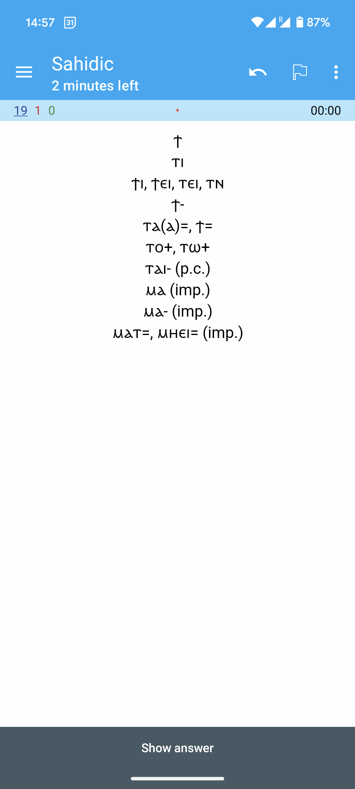
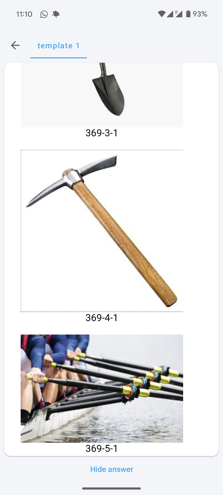
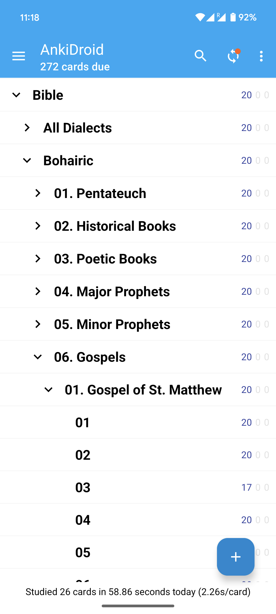
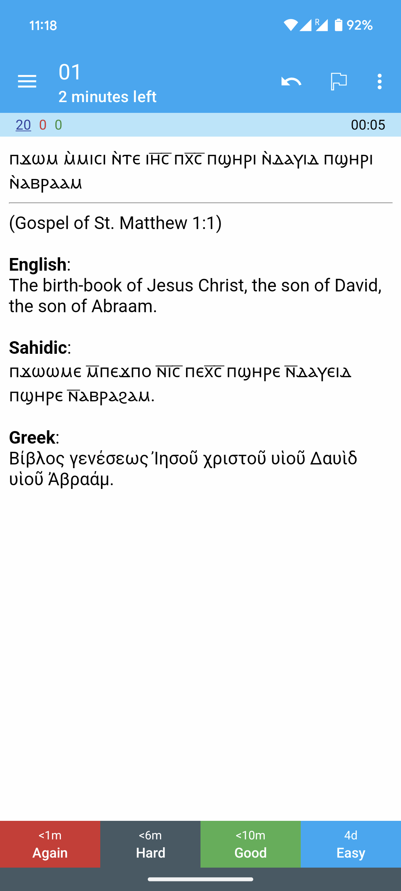
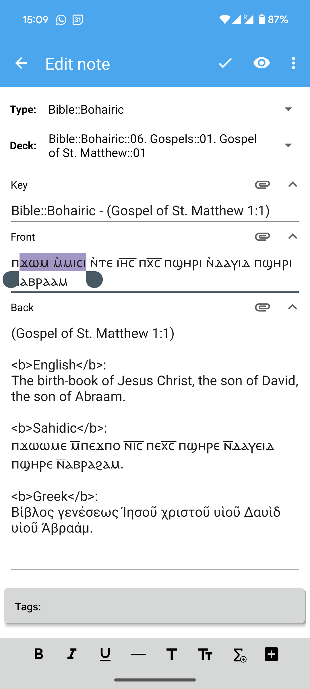

# coptic

Ⲉ̀ϣⲱⲡ ⲁⲓϣⲁⲛⲉⲣⲡⲉⲱⲃϣ Ⲓⲗ̅ⲏ̅ⲙ̅, ⲉⲓⲉ̀ⲉⲣⲡⲱⲃϣ ⲛ̀ⲧⲁⲟⲩⲓⲛⲁⲙ: Ⲡⲁⲗⲁⲥ ⲉϥⲉ̀ϫⲱⲗϫ ⲉ̀ⲧⲁϣ̀ⲃⲱⲃⲓ ⲉ̀ϣⲱⲡ
ⲁⲓϣ̀ⲧⲉⲙⲉⲣⲡⲉⲙⲉⲩⲓ.

<!-- START doctoc generated TOC please keep comment here to allow auto update -->
<!-- DON'T EDIT THIS SECTION, INSTEAD RE-RUN doctoc TO UPDATE -->

- [How to Get the Flashcards](#how-to-get-the-flashcards)
- [Description](#description)
  - [A Coptic Dictionary](#a-coptic-dictionary)
  - [copticsite.com](#copticsitecom)
  - [Bible](#bible)
- [Contact and Contributions](#contact-and-contributions)
  - [Dictionary](#dictionary)
  - [Moawad Dawoud's Diciontary](#moawad-dawouds-diciontary)
  - [Audio](#audio)
  - [Learning Curriculum](#learning-curriculum)
  - [Neologisms](#neologisms)
- [For Developers / Owners](#for-developers--owners)
  - [Directories and Conventions](#directories-and-conventions)
  - [Documentation TODO's](#documentation-todos)
  - [Collaborator Convenience TODO's](#collaborator-convenience-todos)
  - [Diplomacy TODO's](#diplomacy-todos)
  - [Learner Convenience TODO's](#learner-convenience-todos)
  - [Content TODO's](#content-todos)
  - [Developer Convenience TODO's](#developer-convenience-todos)
    - [Guidelines](#guidelines)
  - [Kindle TODO's](#kindle-todos)
  - [Keyboard TODO's](#keyboard-todos)
- [Credits](#credits)

<!-- END doctoc generated TOC please keep comment here to allow auto update -->

This repo hosts a Coptic flashcard / dictionary project that aims at making the
language more **learnable**.

## How to Get the Flashcards

1. Download Anki ([Android](https://play.google.com/store/apps/details?id=com.ichi2.anki),
[iOS](https://apps.apple.com/us/app/ankimobile-flashcards/id373493387)\*,
[Desktop](https://apps.ankiweb.net/)).

   (\**The iOS version is
paid, unfortunately!*)

2. Download [the Coptic package](https://drive.google.com/file/d/1KV0fH23Zucmlvdc0dwTJiDdqKIvbuYY_/view?usp=sharing),
and open it / import it in Anki. This package includes all the data.

   (*Alternatively, you can download individual decks from [this page](
https://ankiweb.net/shared/by-author/836362510). Keep in mind that this page
takes 24 hours to go back live after an update, so it's occasionally down.*)

## Description

The package includes three types of flashcard decks. While the purpose of the
app is to help you learn vocabulary through spaced repetition, it also doubles
as a dictionary because it's searchable.

### A Coptic Dictionary

This is a essentially a **complete** digital version of Crum. The front of the
card shows the *root* spellings. You can choose to view the front in Bohairic,
Sahidic, or all dialects.

<div align="center">
   <figure>
      
      
      
      <br>
      <figcaption> Front in Bohairic, Sahidic, or All Dialects </figcaption>
   </figure>
</div>

The back of the card shows the full list of spellings per dialect, the meaning,
and the derivations table (with prepositions, derived words, ... etc.)
It also includes scans of the Crum pages containing the words, and tells you
where exactly you can find the definition. This data is fully obtained from
Crum's dictionary.

<div align="center">
   <figure>
      
      
      
      
      <br>
      <figcaption> Back </figcaption>
   </figure>
</div>

In some cases, the back includes explanatory pictures as well. The purpose of
the explanatory images is to aid learning by engaging your visual memory as
well, and also to clarify the meaning when the translation is unclear (in many
cases, you will find yourself looking up images anyway to understand the word,
such as with exotic plant species, ancient crafts and tools, ...) Collecting
explanatory images is an ongoing effort.

<div align="center">
   <figure>
      
      
      
      <br>
      <figcaption> Example with Images </figcaption>
   </figure>
</div>

### copticsite.com

This is a simple Coptic / Arabic dictionary obtained from [copticsite.com](
https://copticsite.com/). It has more than 16,000 words, and it includes Greek
loanwords, as we as **neologisms liberally added by the author!**

<div align="center">

   <figure>
      
      
      <br>
      <figcaption> copticsite.com Front and Back </figcaption>
   </figure>

</div>

### Bible

This is Biblical data. We don't have the full Bible in any dialect, but this
contains a lot of the surviving texts, especially in Bohairic, and Sahidic.

The Bohairic version, for example, contains a total of around ~24,000 verses
(roughly 70% of the Bible). All sections are complete except the poetic and,
even less so, the historical books.

<div align="center">
   <figure>
      
      <br>
      <figcaption> Bible Table of Contents </figcaption>
   </figure>
</div>

The front shows the verse in your chosen dialect, and the back shows all
dialects along with the reference and the translation.

<div align="center">
   <figure>
      
      
      <br>
      <figcaption> Bible Front and Back </figcaption>
   </figure>
</div>

Hint: When studying the Bible using flashcards, you can edit the note from the
menu, and turn some expressions or words to to **bold**  or *italics*, so you
will pay attention to it the next time you see the card. Then you can select
*Again* or *Hard* for the verses that contain something that you still want to
learn or memorize, and you can select *Good* or *Easy* for the verses that
you've already learned. **N.B.** Editing the keys will mess things up, but you
can freely edit the front and back.

<div align="center">
   <figure>
      
      <br>
      <figcaption> Editing a Note </figcaption>
   </figure>
</div>

## Contact and Contributions

You can reach out at <pishoybg@gmail.com> for any questions, feedback, or if
you want to contribute. I always read my email, and I read it promptly. Always!

There are two ways you can contribute:

- Manual data collection (no programming expertise needed).

- Coding.

This section lists ways you can contribute data to enrich the flashcards. [The
section below](#for-developers--owners) documents programming contributions.

The contribution pipeline is not yet well-defined. We plan to make it clearer
as to how exactly you can contribute (which files you can write, in which
formats, ... etc.) In the meantime, feel free to look below and reach out with
suggestions or questions, or data! :)

### Dictionary

1. **Collect more explanatory pictures.** (100+ hours, delegated)

   This will significantly aid the
   learning process, and it will save learners the time that they have to spend
   on looking up the obscure vocabulary or unfamiliar terms.

1. Link KELLIA lemmas to Marcion Keys.

   This may make it possible to include the meaning, literature citations, and
   perhaps other data.

   It might also make it possible to expand KELLIA's dictionary.

1. Add meanings that would be displayed on top before Crum's translation.
   Some of Crum's translations are obscure or archaic, and some are outdated
   because we understand the meaning of the word better than he did back then.
   We could use St. Shenouda's Simple Bohairic English dictionary for that, or
   KELLIA's dictionary.
   (low-priority)

1. Collect more explanatory notes. (low-priority)

1. Fix the typos in the data retrieved from Crum. The current dataset is
   high-quality, and has a very small number of typos. However, they do exist.
   (low-priority, and it's more of an ongoing byproduct than a task.)

1. Complete the list of suffixes used for copticsite.com's dictionary.
   (low-priority)

1. Contemplate publishing a version of the flashcards with one derivation per
   note, rather than the entire table. See whether this will aid learning.
   (low-priority)

1. Contemplate sorting the dictionary words by popularity, somehow.
   (low-priority)

1. Contemplate dividing the decks to subsets sorted by popularity, so the
   learners can learn the more important words first. (low-priority)

### Moawad Dawoud's Diciontary

1. **Add Moawad Dawoud's page numbers, and add scans to the flashcards.** (50+
   hours, delegated, in progress)

1. **Add Moawad Dawoud's Arabic translations.** (100+ hours, delegate)

1. Add Moawad Dawoud's standard spellings. (low-priority)

   Crum mentions all spellings, including obscure and rare ones. Dawoud treats
   some as more standard than others, which is helpful. It's worth highlighting
   which spellings are more common.

### Audio

(ambitious goal)

1. **Add pronunciations to the notes.** (100+ hours, delegate)

### Learning Curriculum

(ambitious goal)

1. **Create Duolingo-like learning curricula for learners at multiple levels.**
   (100+ hours, delegate)

### Neologisms

(ambitious goal)

1. **Add neologisms. We need to think first of how to create neologisms before
   we add them to our dataset.** (1000+ hours, delegate)

## For Developers / Owners

For visibility, planned features and improvements must be documented in this
README file (not in any of the README files in the subdirectories).
Non-learner-facing coding tasks are sometimes documented in the code as TODO's,
and sometimes brought here.

### Directories and Conventions

`dictionary/` contains subdirectories, each containing one dictionary, its data,
and the scripts used to process the data into other formats. `bible/` currently
contains a single subdirectory, containing [stshenouda.org](stshenouda.org)'s
version of the Coptic Bible, and the scripts used to process it.

`flashcards/` hosts the logic for creating the flashcard decks. It relies on
data produced under `dictionary/` and `bible/`.

`archive/` and `utils/` are not of particular interest.

There is a total of three README files in this repo. This is intentional, in
order to prevent the documentation from scattering all over. The other two are
under `dictionary/` and `bible/`, and they concern those subprojects
specifically.

Most scripts have default parameters with the assumption that they are being
invoked from the repo's root directory, rather than from the directory where
the script lives.

`secrets.sh` (which is skipped by a rule in `.gitignore`) contains variables
that are used inside `Makefile`. Some `make` rules can only run if preceded by
`source secrets.sh` in order to export the variables needed for those rules.
You need your own version of `secrets.sh` in order to be able to run all the
`make` rules.

The rest of this file lists the current plans or ideas for the project. The
higher-priority items are written in **boldface**.

### Documentation TODO's

(7-8 hours)

1. **Add deck descriptions.**

1. **Revisit the `bible` and `dictionary` documentation in their respective
   README.md files.**

1. **Document the repo in a way that makes it possible to invite collaborators.**

1. **Link Drive items in this repo.**

1. **Move / reproduce TODO's from Drive in the README files.**

1. Use "Crum" in place of "Marcion".

1. Document the snapshot dates and versions of the apps and data imported
into the repo.

### Collaborator Convenience TODO's

1. **Support more seamless integration between Drive and your scripts.** (3-4
   hours)

   Likely, this means letting them contribute through Drive instead of Git.
   List the data sources, and redirect the flow to Drive (think about this!)
   A few sources that immediately come to my mind are:

   - Crum (Roots, derivations, types, meanings, and page numbers)
   - Crum's Notes
   - Crum's Scans
   - Crum's Explanatory Images
   - The Bible
   - [copticsite.com](https://copticsite.com/)'s Dictionary and Suffixes
   - Dawoud's Screenshots
   - Dawoud's Page Numbers
   - future data...

   Thinking about Drive, it might be even easier for users to contribute
   through a sheet instead of a Drive folder (e.g. for notes). Use sheets
   whenever possible.

   Thought: Another possibility is for Git to continue to be the source of truth.
   But what we can do is have users share their contributions via Drive, and then
   we will implement a pipeline to integrate the contributions made through Drive
   into Git.

   **Add a file with some private variables that your scripts can use to publish
   the data to Drive. Include your Drive credentials and local paths and the
   like.**

   1. **Marcion's pipeline should retrieve the data manually collected /
      overridden for `dawoud-pages` and `crum-last-page`, rather than simply
      write an empty placeholder column.** (1-2 hours)

1. **Find / design a software to help users record their pronunciations.** (20
   hours, delegate)

   Candidates:
   - https://github.com/padmalcom/ttsdatasetcreator
   - https://github.com/hollygrimm/voice-dataset-creation
   - https://www.phon.ucl.ac.uk/resource/prorec/

1. Find / design a software to help users collect explanatory images.

### Diplomacy TODO's

1. **Find one or two co-owners of the project.**

1. **Publicize the project, and find an audience of learners.**

1. **Find contributors, in coding and data collection.**

1. **Survey the field one more time. See if there is something else out there
   that you can integrate.**

1. Obtain the source file for St. Shenouda The Archimandrite Coptic Society's
   Simple Bohairic English Dictionary.

1. Obtain the Naqlun dictionary's data. It is poor-quality, but it might
   be attractive for some learners. (low-priority)

1. Obtain an updated version of ⲛⲓⲣⲉϥⲤⲁϫⲓ ⲛ̀ⲣⲉⲙⲛ̀Ⲭⲏⲙⲓ's neologisms.

1. Obtain an updated version of [copticsite.com](https://copticsite.com/)'s dictionary.

1. Get a cleaner, more recent scan of Dawoud's dictionary. Obtain the source
   file if posible. The current scan is low-quality. At the same time, it's
   outdated, and the pages sometimes don't align!

1. Get a cleaner scan of Crum's dictionary. [coptot](
https://coptot.manuscriptroom.com/) has a nice version. Try to obtain it.

### Learner Convenience TODO's

1. **Deploy the flashcards on a standalone app.** (100+ hours, delegate)
   
   This will vastly increase the app's popularity.

1. **Until then, reassess whether Anki is your best bet.** (20 hours, delegate)

   Anki has the following limitations. Perhaps try to find a platform that
   doesn't have some of them. (Though keep in mind that they are not equally
   problematic.)
   - A paid iOS version. (This one is particularly problematic, and will deter
   many potential learners.)
   - No possibility to automatically sync when a new version of the package is
   released.
   - A primitive UI.
   - The possibility to sync notes selectively. (See the note about exporting
   accurate timestamps below.)

1. **Export accurate timestamps.** (50 hours, delegate)

   1. Reimporting (supposedly identical data) produces the message "notes were
   used to update existing ones." This is evidently due to the timestamps that
   the notes are recorded with. The newer timestamps make Anki think that the
   cards are newer, hence it updates everything. This causes the following
   problems:

   - Any changes that a user makes to a note get overridden, even if the note
   content is one that the user has intentionally modified.
   - The sync message is misleading, and lacks information that would otherwise
     be useful.
   - The exported package size is unnecessarily large. We need only export the
     new notes.

   If some notes are identical to ones that have already been exported, they
   should retain their old timestamps, and the new notes should acquire new
   timestamps. This should solve all of the problems above.
   `genanki` doesn't have native support for per-note timestamps, neither does
   it support reading an existing package and comparing the new data against
   it. So we will likely have to do lots of manual work to solve the problem.

   One idea that comes to mind is to export **untimestamped** data first to a
   TSV, rather than a package directly, to make processing either. We can use
   **versioning**, and export a new TSV every time we rerun the script. Then we
   can have another script whose sole purpose is:
   1. Compare two TSV's containing notes, and
      1. Use `genanki` to generate a package containing only the delta between
         the two versions, or
      1. Use a new version of `genanki` to generate a new package containing
         accurate timestamps.

   This will facilitate testing. A developer can `diff` two TSVs to find out
   what changes (if any) their code has introduced. (Although there is an
   existing plan to enable testing by using a dummy timestamp, though this will
   only make it possible to check for equality, rather than print a
   human-readable `diff`).

   Another big advantage of the introduction of an intermediate state is
   facilitating a fanout to multiple platforms. Our generators should start by
   generating the TSV package, then our platform-specific generators can take
   that package snapshot and produce an package for different platforms such as
   Anki, Cloze, or something else.

   Learners who synchronize their data will only have the old notes overridden.

1. Fix the model sync issues.

   In the current design, updating the CSS of a deck doesn't get reflected when
   the package is imported. The notes retain the old CSS.

   Changing the model ID results in synchronization difficulties due to the
   note type having changed.

### Content TODO's

1. **Crum: Take derivations into consideration when deciding whether a given
   word belongs to a dialect.** (1-2 hours)

1. **Add links to CDO from Crum.** (3-4 hou4s)

   The url is `https://coptic-dictionary.org/results.cgi?quick_search={key}`.

1. **Revisit the Greek dictionary used, and allow spaces between words.**
   (3-4 hours)

1. **Prettify and expand the flashcards from [KELLIA](
https://coptic-dictionary.org/).** (7-8 hours)

   1. Group `geo`s by `orth` and `gram_grp`.
   1. Add the entity types. (low-priority)
   1. Include IDs in comments. (low-priority)

   Look at the results page on [coptic-dictionary.org](
   https://coptic-dictionary.org/) for inspiration.
   It is generated by [
   https://github.com/KELLIA/dictionary/blob/master/entry.cgi](
   https://github.com/KELLIA/dictionary/blob/master/entry.cgi).

   Some data may require interactions with Scriptorium tools.

1. **Create dialect-oriented versions of the KELLIA decks.** (7-8 hours)

1. **Incorporate [Scriptorium](https://copticscriptorium.org/)'s data and NLP
tools.** (50 hours, delegate)

   - Start by gaining familiarity with their products, and selecting the ones
   that will be useful for you. From a quick look, the part-of-speech tagger,
   and automatic segmentation, entity visualizer, lemmatizer,
   language-of-origin tagger, are all good candidates.

1. **Crawl [Wiktionary - Category:Coptic lemmas](
https://en.wiktionary.org/wiki/Category:Coptic_lemmas).** (20+ hours, delegate)

1. **Incorporate the ⲛⲓⲣⲉϥⲤⲁϫⲓ ⲛ̀ⲣⲉⲙⲛ̀Ⲭⲏⲙⲓ Group's neologisms.** (3-4 hours)

1. **Group the derivations by dialect.** (2 days)

   Now, ... The tricky thing about this task is that, while parsing the
   derivations, it's hard to tell whether a certain row belongs to a given
   dialect or not. If we can easily decide on the correct subset of rows that
   belongs to the dialect at hand, generating the table should be easy.

   There are the following situations:

   1. A row explicitly states its bearing words in the dialect. Easy.

   1. A row is a header. Easy.

   1. A row has a child that belongs to the dialect. We also include it,
      although the way we implemented this check is hacky and needs a cleanup.
      We should reimplement it using proper tree construction.

   1. Now, what if a row is not a header, has no children belonging to the
      dialect, and doesn't specify any dialects itself? Previously, we assumed
      that such rows should be treated as belonging to all dialects (that's
      what we do with the roots). But we can't apply that to derivations, which
      often intentionally omit the dialect list. A good heuristic is to examine
      the parents and try to infer the dialect list from the parents.

   The best way to accomplish this is through a proper construction of an
   annotated tree, meaning that the notes shouldn't only bear the raw data, but
   the parsing results as well. This will provide the `tree` module with the
   data needed to implement a better heuristic.

### Developer Convenience TODO's

1. **Write the flashcard data to an intermediate format before `.apkg`.** (20
   hours)

   This has the following advantages:
   - It becomes easier to verify what changes a commit introduces to the
   flashcards.
   - Git will track the history of the flashcard content.
   - Significantly reduce the running time, as writing the flashcards to a
   database currently takes more than 70% of the running time of
   `flashcards/main.py`. Splitting the two steps would make it possible to run
   the first one (which is being more actively developed) in a fraction of the
   time.
   - It is a plausible solution for the timestamping problem currently faced.
   - Support a fanout to platforms other than Anki.

1. **Set up a more robust CI/CD pipelines.** (20 hours)

   To start with, set up proper dependencies in Makefile.

   Note: This is proving difficult! We could perhaps consider migrating to
   CMake or even Bazel.

1. Pick up some of the Easter egg tasks left around the code:

   ```bash
   grep TODO -R bible dictionary keyboard flashcards
   ```

   Move them to README files when more visibility is warranted. Delete them
   when they are deemed irrelevant.

#### Guidelines

1. While unit tests are low-priority right now given the feasibility of other
   methods of testing, such as the code assertions, and visual inspections of
   the output, unit tests are still desirable. Consider expanding them.

1. Use pre-commit hooks.

1. Do not let Python tempt you to use its built-in types instead of classes and
   objects. Don't forget about OOP!

1. Document the code.

1. Add assertions and throw exceptions for any assumptions that you make. They
   catch a lot of bugs! A lot!

1. Force type hints. Use
   [type_enforced](https://github.com/connor-makowski/type_enforced).
   - Set type enforcement per class rather than per method.
   - Move your helpers, such as your `Callable`, to a shared package.

1. Collect and print stats.

1. Strip inputs more liberally.

### Kindle TODO's

1. **Create a [Kindle-compatible dictionary](
https://kdp.amazon.com/en_US/help/topic/G2HXJS944GL88DNV).** (50+ hours)

   There has been [an
   attempt](https://github.com/louiseyousre2020/coptic-words) to implement
   a Coptic inflection module. Look at it for inspiration.

   See [this use case](https://github.com/runehol/kindlearadict) for Arabic,
   another morphologically complex language.

   This can start humble and grow with time. No need to perfect it from the
   first time.

1. **Make a plan to improve the accuracy of the inflections module.** (unknown)

1. **Display the Bible data in a table format.** (7-8 hours)

   The reason the Bible was chosen to be displayed is that it showed difficulty
   with highlighting. There is some information about this
   [here](https://kdp.amazon.com/en_US/help/topic/GZ8BAXASXKB5JVML), and a
   workaround may be possible.

### Keyboard TODO's

1. Complete your [keyboard
proposal](
https://docs.google.com/document/d/1-pvMfGssGK22F9bPyjUv7_siwIf932NYROSKgXM0DDk/edit
). (100+ hours)

## Credits

The data used here was digitalized and published through the efforts of:

1. Milan Konvicka, creator of [Marcion](https://marcion.sourceforge.net/)

1. Hany Takla, founder of [Saint Shenouda The Archimandrite – Coptic
   Society](http://stshenouda.org/)

1. Osama Thabet, creator of [copticsite.com](https://copticsite.com/)

1. [Kyrillos Wannes](https://twitter.com/kyrilloswannes), author of *Een 
   Inleiding tot Bohairisch Koptisch*, who is rigorously
   collecting Marcion-Dawoud mapping for the flashcards project.
