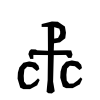

<div align="center">
   <figure>
      <a href="https://remnqymi.com/" target="_blank"></a>
   </figure>
</div>


# [ⲣⲉⲙⲛ̀Ⲭⲏⲙⲓ](https://remnqymi.com/)

This is the backing repo for [ⲣⲉⲙⲛ̀Ⲭⲏⲙⲓ](https://remnqymi.com/), a project
that aims to make the Coptic language more **learnable**.

<!-- START doctoc generated TOC please keep comment here to allow auto update -->
<!-- DON'T EDIT THIS SECTION, INSTEAD RE-RUN doctoc TO UPDATE -->

- [Technical Docs](#technical-docs)
  - [Hosting](#hosting)
  - [Getting started](#getting-started)
  - [Planning](#planning)
    - [Components](#components)
    - [Milestones](#milestones)
    - [Issues](#issues)
    - [Labels](#labels)
    - [Project](#project)
    - [Commits](#commits)
  - [Guidelines](#guidelines)
    - [Languages](#languages)
- [Project-specific](#project-specific)
  - [`dictionary/`](#dictionary)
    - [Marcion](#marcion)
      - [Image Collection](#image-collection)
        - [Why?](#why)
        - [Technical Guidelines](#technical-guidelines)
    - [KELLIA](#kellia)
  - [`bible/`](#bible)
  - [`flashcards/`](#flashcards)
  - [`morphology/`](#morphology)
  - [`docs/`](#docs)
  - [`xooxle/`](#xooxle)
- [Data Collection](#data-collection)

<!-- END doctoc generated TOC please keep comment here to allow auto update -->
# Technical Docs

## Hosting

We use:

- [GitHub](https://github.com/pishoyg/coptic/) for our code base.
- [GitHub Pages](https://github.com/pishoyg/coptic/settings/pages) for our
[website](https://remnqymi.com/).
- [AWS Route 53](https://us-east-1.console.aws.amazon.com/route53/v2/hostedzones)
for domain registration and DNS.
- [Google
Drive](https://drive.google.com/drive/folders/17jI92CKumjYQTXghThaaejPeD8ZbifPm?usp=drive_link) and [Google Cloud](https://console.cloud.google.com/welcome) for cloud storage.
- [Google Analytics](https://analytics.google.com/) and [Google Search
Console](https://search.google.com/search-console?resource_id=sc-domain%3Aremnqymi.com)
for traffic tracking and analysis.

## Getting started

1. Clone the repo with `--depth=1` because the history is huge, and much of the
   outrageously large files have been cleaned up.
   ```sh
   git clone https://github.com/pishoyg/coptic.git --depth=1
   ```

1. Setting up the environment is necessary for a lot of pipelines to work.

   In general, you should run this at the beginning of each development session:

   ```sh
   source .env
   ```

   Equivalently:

   ```sh
   . ./.env
   ```

   This sets up the Python virtual environment; and exports many environment
   variables and helpers, some of which are used by the pipelines, and some are
   simply intended for developer convenience.

   Alternatively, you can define a hook that would source it automatically once
   you `cd` into the directory. If you use ZSH, you can add the following to your
   `.zshrc` (replacing `${PATH_TO_COPTIC_REPO}` with the path to this repo):

   ```sh
   coptic_source_hook() {
     if [[ $PWD == "${PATH_TO_COPTIC_REPO}" ]]; then
       source ./.env
       chpwd_functions[(Ie)$0]=() # remove ourselves from the array
     fi
   }
   chpwd_functions+=(coptic_source_hook)
   ```

   For Bash, add this to your `.bashrc` (replacing `${PATH_TO_COPTIC_REPO}`
   appropriately):
   ```sh
   coptic_source_hook() {
     if [[ "$PWD" == "${PATH_TO_COPTIC_REPO}" ]]; then
       source ./.env
       PROMPT_COMMAND=${PROMPT_COMMAND//coptic_source_hook;/}
     fi
   }

   PROMPT_COMMAND="coptic_source_hook; $PROMPT_COMMAND"
   ```

1. Running `make install` should take care of most of the installations.
   Sourcing `.env` is necessary for this to work. Though `make install` only
needs to be run once, while `.env` needs to be sourced for each session.

   If there are missing binaries that you need to download, `make install` will
   let you know. You *may* also need to log in with
   [`gh`](https://cli.github.com/).

1. Our pipelines are defined in [`Makefile`](Makefile). Though some pipelines in
   [`Makefile`](Makefile) are only used during development and testing, and are
not relevant for output regeneration.

1. Keep in mind that parameters are written with the assumption that scripts are
   being invoked from the repo's root directory, rather than from the directory
where the script lives. You should do most of your development in the root
directory.

1. This file is the only `README.md` in the repo (and this is enforced by a
   pre-commit hook). Technical documentation is intentionally centralized.
Besides this file, docs can be found in:

   - In-code comments
   - [Planning framework](#planning)
   - [Commit messages](https://github.com/pishoyg/coptic/commits/) (*albeit less significantly*)

   User-facing documentation shouldn't live on the repo, but should go on [the
   website](http://remnqymi.com/) instead.

1. We use pre-commit hooks extensively, and they have helped us discover a lot
   of bugs and issues with our code, and also keep our repo organized. They are
not optional. Their installation should be covered by `make install`. They are
defined in [`.pre-commit-config.yaml`](.pre-commit-config.yaml). They run
automatically before a commit. You can execute the following to appease them
(keep running them and applying their changes until they all pass), though keep
in mind that `make test` runs `git add --all`:

   ```sh
   make test
   ```

   Our pipelines currently have minimal dependencies. For a pair of dependent
   pipelines (where one downstream pipeline consumes the output of another upstream
   pipeline), the downstream will fare well even if pre-commits haven't been
   executed on the output of the upstream pipeline.
   If this were to change, reopen #120.

   [](https://github.com/pre-commit/pre-commit)


## Planning

We use GitHub to track our plans and TODO's.

### Components

This list of components helps us group our work into a number of well-defined
focus areas. Milestones usually concern themselves with one of the components,
and issues and commit messages should be prefixed with a component name between
square brackets.

1. Crum: Crum's dictionary
1. KELLIA: KELLIA's dictionary
1. Andreas: Andreas's dictionary
1. Dawoud: Dawoud's dictionary
1. Bible: The Coptic Bible
1. Lexicon: [ⲡⲓⲖⲉⲝⲓⲕⲟⲛ](http://remnqymi.com/crum/)
1. Site: [Our website](http://remnqymi.com/)
1. Morphology: Our morphological analysis pipelines
1. platform: development platform and tooling
1. Community: Community of contributors and users
1. App
1. Keyboard

### [Milestones](https://github.com/pishoyg/coptic/milestones?direction=asc&sort=due_date&state=open)

- Milestones represent long-term, complex goals or deliverables. They help us
draw our project path, and what it is that we're trying to achieve in the long
run. Milestones are a translation of the project's mission.

- Besides the more specific milestones that represent concrete goals, we have
  `(backlog)` milestones, that represent miscellaneous pending improvements,
technical debt, optimizations, or desired changes; but which don't block the
achievement of one of the project's main goals.

- Milestone priorities are assigned using **due dates**.

- The number of milestones should remain _under control_.

- When work on a milestone is good enough, it's closed, the achievement is
celebrated, and its remaining issues move to a corresponding `backlog` milestone.

- As much as possible, each milestone should be concerned with a given
_component_.

### [Issues](https://github.com/pishoyg/coptic/issues/)

- Every issue [must belong to a
milestone](https://github.com/pishoyg/coptic/issues/?q=is%3Aissue%20state%3Aopen%20no%3Amilestone).

- Issues need to be specific and isolated, with a clear definition-of-done. They
ideally span a single component and involve a local change or set of local
changes, although they can sometimes span multiple components.

- High-priority issues are marked in a number of ways:
   - The [`favorable` label](https://github.com/pishoyg/coptic/labels/favorable).
   - Assignment to a developer
   - Belonging to a high-priority milestone.

- Add `TODO`s to the code whenever appropriate, always following `TODO` with a
colon, a space, and an issue number (with the pound sign) surrounded by
parenthesis. This format is enforced by a pre-commit hook, though the hook only
picks up a `TODO` if it's immediately followed by `:`. If the `TODO` is
low-priority, and isn't worth an associated issue, you can assign it to the
pseudo-issue `#0`.

### [Labels](https://github.com/pishoyg/coptic/labels)

Wherever possible, use labels to help track and organize issues. Issues mostly
have exactly one *How*, and usually one *Why*.

Refer to [labels](https://github.com/pishoyg/coptic/labels/) for the most recent
definitions, but they should belong to the following categories:
   - `How`
     - How can the task be achieved?
       - `architect`: Planning and design.
       - `diplomacy`: Diplomacy, connections, and reachout.
       - `documentation`: Writing documentation.
       - `labor`: Manual data collection.
       - `code`: There is no `code` label, because that includes most tasks. A task
         that doesn't have another `How` label is probably a `code` task.
   - `Who`
     - Is the issue user-facing or developer-oriented?
       - `user`: A user-oriented improvement.
       - `dev`: A developer-oriented, not user-visible, improvement.
   - `Why`
     - What is the purpose of this issue?
       - `data`: Expand the data that we own.
       - `rigor`: Improve the rigor (particularly when it comes to such issues
       parsing, or inflection generation).
       - `UI`: Improve the user interface.
       - `bug`: Fix a bug.
       - `community`: Grow the ⲣⲉⲙⲛ̀Ⲭⲏⲙⲓ community.
   - `What`:
       A generic set of labels:
       - `favorable`: Nice to do soon.
       - `backlog`: Low-impact / low-priority.
       - `reports`: User reports.

### [Project](https://github.com/users/pishoyg/projects/3)

The [project](https://github.com/users/pishoyg/projects/3) page offers
alternative *views* of the issues, which can come in handy for planning
purposes.

### [Commits](https://github.com/pishoyg/coptic/commits/)

- Use the following format for the first line of the commit message:
   ```
   [#${ISSUE}][${COMPONENT}/${SUBCOMPONENT}] ${DESCRIPTION}
   ```

- Use proper punctuation and capitalization.
- The subcomponent is optional.
- Use `fix #${ISSUE}` to automatically close an issue with the commit.
- Besides the description line, include more details in the body of the commit
message, though make sure that the more important docs live in the code.

## Guidelines

1. Add excessive in-code assertions, and always validate your assumptions. This
   is our first line of defense, and has been the champion when it comes to
ensuring correctness and catching bugs.

1. When it comes to error checking:
   - Employ assertions for sanity checks, such as catching logic errors, or
   situations that are impossible if your code is correct.
   - Employ exceptions for errors that _may_ occur – such as potential typos in
   the input data.

   Exceptions tend to have error messages, which may be helpful. Assertions tend
   to simply crash without context. Use exceptions when the presence of an error
   message may be helpful.

1. Use our `utils` packages where appropriate:
   - [Python](./utils/)
   - [TypeScript](./docs/)

1. Use our `paths` packages to store (1) the project's internal structure,
   including subdirectories to other components, and (2) external dependencies:
   - [Python](utils/paths.py)
   - [TypeScript](docs/paths.ts)

1. Document the code appropriately, though not verbosely, especially where not
   intuitive or where known issues should be called out.

1. Use type hints extensively.

1. Prefer implementing features using browser JavaScript, instead of keeping
   them in the HTML. However, prefer storing any visible text in HTML, and
invisible elements (such as tooltips) in JavaScript.

1. Avoid using a generic `utils` package. It can easily become a catch-all for
unrelated logic, grow excessively large, and lose clear purpose. Instead,
organize utilities into purpose-specific packages based on functionality.

1. Some of our projects have a `data` directory. This can contain subdirectories
   as follows:

   - `raw/`: Data that is **copied** from elsewhere. This would, for example,
   include the Marcion SQL tables copied as is, unmodified. The contents of this
   directory remain true to the original source.

   - `input/`: Data that we either *modified* or *created*. If we want to fix
   typos to data that we copied, we don't touch the data under `raw/`, but we take
   the liberty to modify the copies that live under `input/`.

1. It has been helpful to be able to know, from a quick glance at a TypeScript
   file:
   1. What the classes used are.
   1. What listeners are registered.
   1. What elements are retrieved from the document.

   Therefore, whenever possible, try to abide by the following:
   1. Group all classes in a `cls.ts` file or a `CLS` enum.
   1. Prefer the following syntax:
      ```ts
      element.addEventListener('click', () => {});
      ```
      over this:
      ```ts
      element.onclick = () => {};
      ```
   1. Use `querySelector` or `querySelectorAll` instead of such methods as
      `getElementsByClassName` or `getElementsByTagName`. The only exception is
      when retrieving an element by ID, in which case we enforce
   `getElementById`.

### Languages

- Our pipelines are primarily written in **Python**.

- **Bash** is occasionally employed when Python would be significantly more
verbose.

- We use **TypeScript** for static site logic. It then gets transpiled to
JavaScript by running `make transpile`. Never write JavaScript directly.

- Had we had better foresight, or anticipated the growth of the project to what
it is today, pipelines would've been implemented in TypeScript as well, and
Python wouldn't have been employed altogether. Maintaining two languages adds
overhead, and results in much regrettable duplication. A complete migration to
TypeScript is being contemplated (#561, #183). Prefer TypeScript where possible.

- Never extend the set of languages beyond the above unless required by the
platform.

# Project-specific

## [`dictionary/`](dictionary/)

This directory contains the data and logic for processing our dictionaries.

### [Marcion](dictionary/marcion_sourceforge_net/)

#### Image Collection

##### Why?

There are many reasons we have decided to add images to our dictionary, and
heavily invested in the image pipeline. They have become one of the integral
pieces of our dictionary framework.

1. The meaning of a word is more strongly and concretely conveyed by an image
   than by a word. Learning is ultimately about creating the neural pathways
that enable language to flow naturally. A given word needs to settle and connect
with nodes in your [associative
memory](https://en.wikipedia.org/wiki/Associative_memory_(psychology)) in order
for you to be able to use it. It aids the learning process to achieve as much
neural activation as possible during learning. This is much better achieved by
an image than by a mere English translation. Visual processing areas of our
brains are bigger, faster, and more primordial, than language processing areas.
The use of images make vocabulary learning more effective and efficient.

2. Oftentimes, words describe concepts that are unfamiliar to readers. Embedding
   images saves readers the time they would take to otherwise look up and
learn about the word.

3. Images are taken more seriously by readers than words. Where a Coptic word
   covers a wide semantic range with many senses, those senses are often
dismissed by readers who tend to focus on one sense and see the others as
auxiliary. Use of images legitimizes senses in the eyes of readers, and
persuades them to accept and recognize the wider semantic range that the Coptic
word has.

   Images therefore must be deeply contemplated and carefully selected.
   Collecting images is comparable to the very authoring itself of the
   dictionary.

##### Technical Guidelines

1. Each image ends up being resized to a width of 300 pixel and a height
proportional to the original. We prefer images with a minimum width of 300
pixels, though down to 200 is acceptable.

1. As for image height, short images are rarely ugly, but long images usually
are. So we set a generously low lower bound of 100 pixels on the resized
height, but set a stricter upper bound of 500 pixels. Although we tend to
prefer the height to fall within a range of 200 to 400 pixels.

1. Collecting sources is mandatory. We always record the URL that an image is
retrieved from. Our [`img_helper`](
dictionary/marcion_sourceforge_net/img_helper.py) script, which we use to
process images, can be supplied by a URL, and it will download the image and
store the source (and also resize the image to the final version). This
simplifies the process.

1. We make extensive use of *icons*. They can capture the meaning of a word in
situations when it's otherwise hard to describe a word using an image
([example](https://remnqymi.com/crum/11.html)).

1. When given a choice, prefer an ancient Egyptian explanatory image, followed
   by an old (not necessarily Egyptian) image, followed by a modern image
([example]( https://remnqymi.com/crum/1436.html)). We prefer to keep the images
as close as possible to their reflections in the mind of a native speaker. We
also want to stress the fact that those Coptic words can be equally used to
refer to entities from other cultures, or modern entities.

   This could be revisited later.

### [KELLIA](dictionary/kellia_uni_goettingen_de)

The core of this dictionary is the [TLA](https://aaew.bbaw.de/tla/) and
[DDGLC](https://dioskoros.org/); and, as of the time of writing, supplemental
forms added by [Coptic Scriptorium](https://copticscriptorium.org/) to
[CDO](https://coptic-dictionary.org/).

See [`kellia.py`](dictionary/kellia_uni_goettingen_de/kellia.py) for current
status and documentation.

## [`bible/`](bible/)

This directory contains the data and logic for processing the Bible corpus.

## [`flashcards/`](flashcards/)

This directory contains the data and logic for processing dictionaries into
*flashcards* and Lexicon. It is named as such because our first use case was a
flashcard app, although our use of the dictionaries has since become more
versatile.

## [`morphology/`](morphology/)

This directory contains the data and logic for generating the morphological
dictionaries (to support inflections).

## [`docs/`](docs/)

This directory contains the static data for [our website](http://remnqymi.com/).
It contains the TypeScript source tree, CSS, some hand-written HTML, and many
generated artifacts. See
[`pre-commit/docs_structure.py`](pre-commit/docs_structure.py) for the
contents of the directory.

## [`xooxle/`](xooxle/)

This directory contains the search index generator. Its front-end counterpart is
[`docs/xooxle.ts`](docs/xooxlets).

# Data Collection

We need data collectors. Data collection tasks bear the [`labor`
label](https://github.com/pishoyg/coptic/labels/labor). The [`data`
label](https://github.com/pishoyg/coptic/labels/data) is related, but is more
generic.

***
Ⲉ̀ϣⲱⲡ ⲁⲓϣⲁⲛⲉⲣⲡⲉⲱⲃϣ Ⲓⲗ̅ⲏ̅ⲙ̅, ⲉⲓⲉ̀ⲉⲣⲡⲱⲃϣ ⲛ̀ⲧⲁⲟⲩⲓⲛⲁⲙ: Ⲡⲁⲗⲁⲥ ⲉϥⲉ̀ϫⲱⲗϫ ⲉ̀ⲧⲁϣ̀ⲃⲱⲃⲓ ⲉ̀ϣⲱⲡ
ⲁⲓϣ̀ⲧⲉⲙⲉⲣⲡⲉⲙⲉⲩⲓ.
