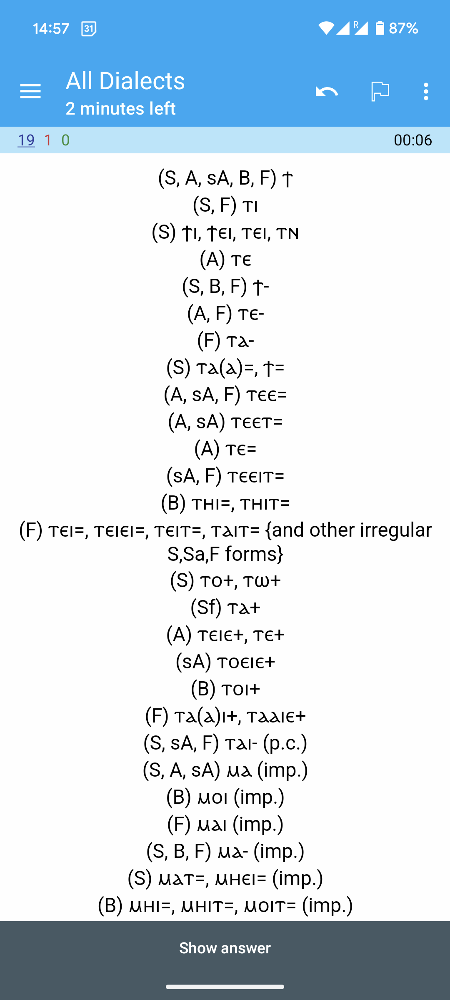
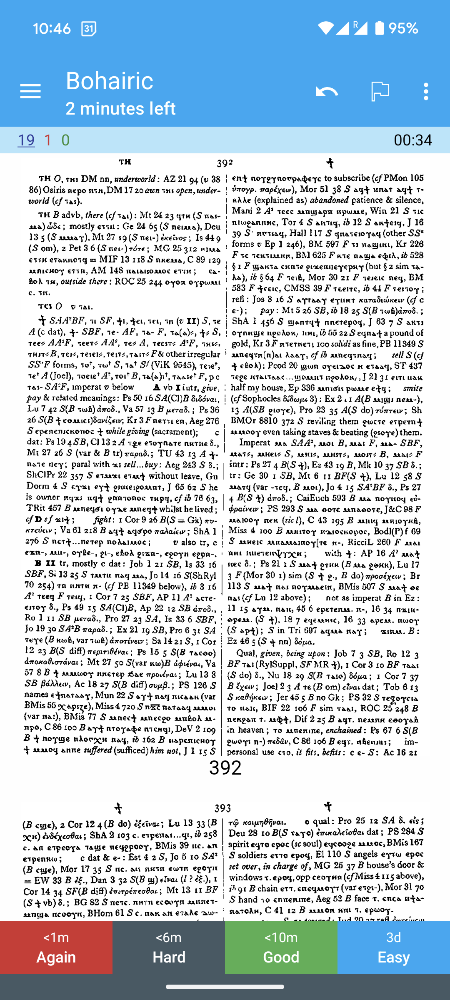
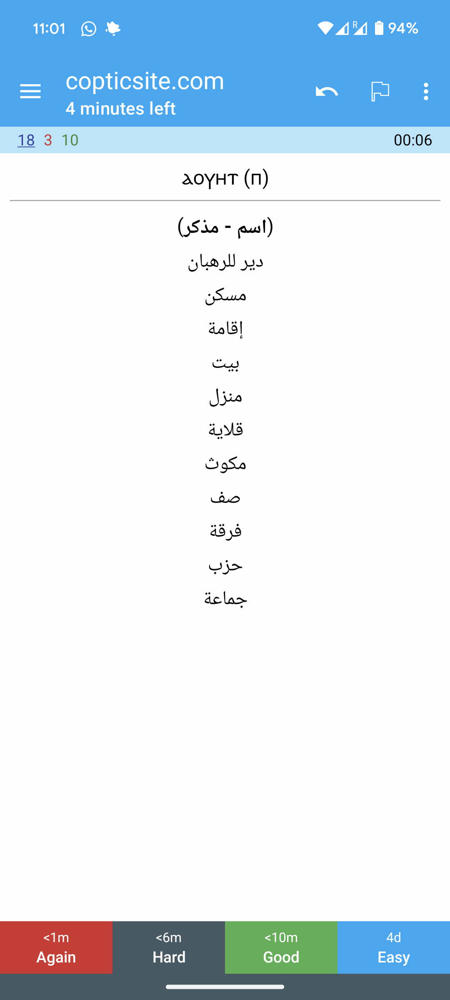

# ⲙⲉⲧⲣⲉⲙⲛ̀Ⲭⲏⲙⲓ

Ⲉ̀ϣⲱⲡ ⲁⲓϣⲁⲛⲉⲣⲡⲉⲱⲃϣ Ⲓⲗ̅ⲏ̅ⲙ̅, ⲉⲓⲉ̀ⲉⲣⲡⲱⲃϣ ⲛ̀ⲧⲁⲟⲩⲓⲛⲁⲙ: Ⲡⲁⲗⲁⲥ ⲉϥⲉ̀ϫⲱⲗϫ ⲉ̀ⲧⲁϣ̀ⲃⲱⲃⲓ ⲉ̀ϣⲱⲡ
ⲁⲓϣ̀ⲧⲉⲙⲉⲣⲡⲉⲙⲉⲩⲓ.

<!-- START doctoc generated TOC please keep comment here to allow auto update -->
<!-- DON'T EDIT THIS SECTION, INSTEAD RE-RUN doctoc TO UPDATE -->

- [How to Get the Flashcards](#how-to-get-the-flashcards)
- [Description](#description)
  - [A Coptic Dictionary](#a-coptic-dictionary)
  - [copticsite.com](#copticsitecom)
- [Contact and Contributions](#contact-and-contributions)
- [Credits](#credits)

<!-- END doctoc generated TOC please keep comment here to allow auto update -->

This site hosts a suite of products that aims to make Coptic more **learnable**.

## How to Get the Flashcards

1. Download Anki ([Android](https://play.google.com/store/apps/details?id=com.ichi2.anki),
[iOS](https://apps.apple.com/us/app/ankimobile-flashcards/id373493387)\*,
[Desktop](https://apps.ankiweb.net/)).

   (\**The iOS version is
paid, unfortunately!*)

2. Download [the Coptic package](https://drive.google.com/file/d/1KV0fH23Zucmlvdc0dwTJiDdqKIvbuYY_/view?usp=sharing),
and open it / import it in Anki. This package includes all the data.

   **N.B. The package is updated regularly (almost daily), so make sure
   to save the link and come back occasionally to download the updated version.**

## Description

The package includes two types of flashcard decks. While the purpose of the
app is to help you learn vocabulary through spaced repetition, it also doubles
as a dictionary because it's searchable.

### A Coptic Dictionary

This is a essentially a **complete** digital version of Crum. The front of the
card shows the *root* spellings. You can choose to view the front in Bohairic,
Sahidic, or all dialects.

   <figure>
      
      
      
       
      <figcaption> Front in Bohairic, Sahidic, or All Dialects </figcaption>
   </figure>

The back of the card shows the full list of spellings per dialect, the meaning,
and the derivations table (with prepositions, derived words, ... etc.)
It also includes scans of the Crum pages containing the words, and tells you
where exactly you can find the definition. This data is fully obtained from
Crum's dictionary.

   <figure>
      
      
      
      
       
      <figcaption> Back </figcaption>
   </figure>

In some cases, the back includes explanatory pictures as well. The purpose of
the explanatory images is to aid learning by engaging your visual memory as
well, and also to clarify the meaning when the translation is unclear (in many
cases, you will find yourself looking up images anyway to understand the word,
such as with exotic plant species, ancient crafts and tools, ...) Collecting
explanatory images is an ongoing effort.

   <figure>
      
      
      
       
      <figcaption> Example with Images </figcaption>
   </figure>

### copticsite.com

This is a simple Coptic / Arabic dictionary obtained from [copticsite.com](
https://copticsite.com/). It has more than 16,000 words, and it includes Greek
loanwords, as we as **neologisms liberally added by the author!**

   <figure>
      
      
       
      <figcaption> copticsite.com Front and Back </figcaption>
   </figure>

## Contact and Contributions

You can reach out at <pishoybg@gmail.com> for any questions, feedback, or if
you want to contribute. I always read my email, and I read it promptly.

There are two ways you can contribute:

- Manual data collection (no programming expertise needed).

- Coding.

The contribution pipeline is not yet well-defined. We plan to make it clearer
as to how exactly you can contribute (which files you can write, in which
formats, ... etc.) In the meantime, feel free to look below and reach out with
suggestions or questions, or data! :)

## Credits

The data used here was digitalized and published through the efforts of:

1. Milan Konvicka, creator of [Marcion](https://marcion.sourceforge.net/)

1. Hany Takla, founder of [Saint Shenouda The Archimandrite – Coptic
   Society](http://stshenouda.org/)

1. Osama Thabet, creator of [copticsite.com](https://copticsite.com/)

1. [Kyrillos Wannes](https://twitter.com/kyrilloswannes), author of *Een
   Inleiding tot Bohairisch Koptisch*.
